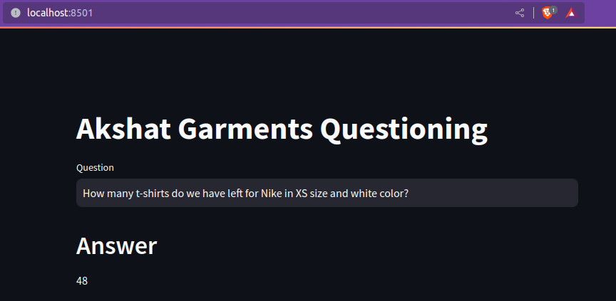

# SQL query ChatBOT

This project will help uses to talk to their sql database and query results using natural language.

# Preview



# Setup

## Cloning git repo
```console
git clone https://github.com/akshatsingh1718/GarmentsSQL_QnA
cd GarmentsSQL_QnA
```

## Create virtual env
```console
python3 -m venv venv
source .venv/bin/activate
```

## Install requirements.txt
```console
pip3 install -r requirements.txt
```

> ! NOTE: This program is working with Python version 3.8.10, other versions may not work.

## Get Api Key

## Google Palm LLM API KEY

- If you are using GooglePalm as your llm get your Google Palm api key from [here](https://makersuite.google.com/app/apikey)

# Setting test tables

- If you want to just test this project before using your own tables you can use the following command to create dummy data.

```console
mysql -u root -p atliq_tshirts < <PATH_TO_SQL_SCRIPT>/database.sql
```

## Setting Few shots examples

- If you dont want to use few shot examples in your query then do the following in your [utils.py](./utils.py) file.
```python
USE_FEWSHOT_EXAMPLES= False
```

> Ingore Setup Embeddings step if USE_FEWSHOT_EXAMPLES = False

- If you want to use few shot exaples then do the following in your [utils.py](./utils.py) file.
```python
USE_FEWSHOT_EXAMPLES= True
```

- Now create some examples question in natrual langugage and also create their corresponding SQL along with their outputs and write them in [few_shot_examples.py](./few_shot_examples.py) file.

```python
few_shots = [
    {
        "Question": <NATURAL_LANGUAGE_QUESTION>,
        "SQLQuery": <SQL_QUERY>,
        "SQLResult": "Result of the SQL query",
        "Answer": <ANSWER>,
    },
    ...
]
```


## Setup Embeddings

- Here we can use both OpenAIEmbeddings or HuggingFaceEmbeddings. If you want to use OpenAIEmbeddings do the below changes in [utils.py](./utils.py).

```python
USE_OPENAI_EMBEDDINGS= True
```

## setting up `.env` file

Set your environment variables like database credentials and api keys.

```
GOOGLE_API_KEY= <GOOGLE_API_KEY>
DB_USER=<DB_USER>
DB_PASSWORD=<DB_PASSWORD>
DB_HOST=<DB_HOST>
DB_NAME=<DB_NAME>
OPENAI_API_KEY=sk-...
```

# Execute program

```console
streamlit run main.py   
```

# Code understanding

For understanding code line by line you can see [cookbook.ipynb](./cookbook.ipynb) file.

